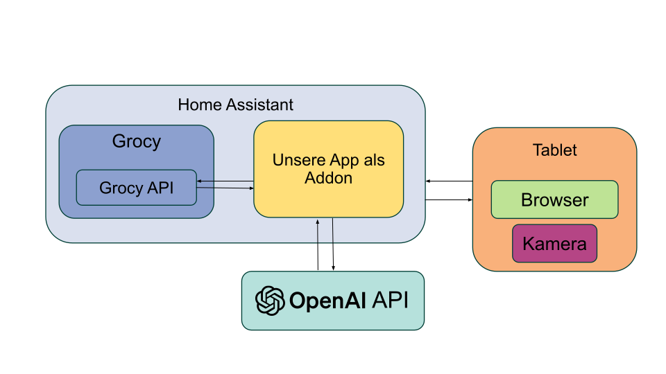
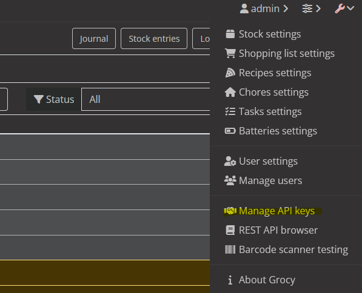
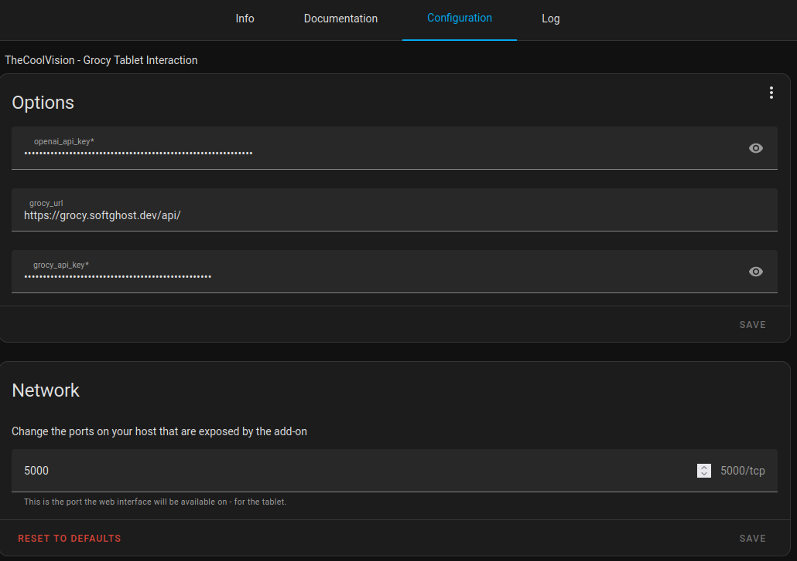

# TheCoolVision

## Project

 This project is part of a university course Alltagsautomatisierung. The goal is to create a vision system that can be used to track the inventory of a fridge. Our goal for the project was to make it as user friendly as possible to interact with.

- Aaron Kreis
- Felix Marschall
- Moritz Spohn

Supervised by Fabian Rybinski.

## Architecture



HomeAssistant is the platform to host our addon and homeassistant.
Grocy stores data and has features e.g. an app with QR-Code Scanner. OpenAI is used for food image recognition.

The peripheral device needs to have a camera and internet browser to access the homeassistant instance. 

## Grocy

An Grocy instance is needed. Choose between:

1. HomeAssistant Addon https://github.com/hassio-addons/addon-grocy
2. Official https://grocy.info/de
3. Docker and more https://grocy.info/addons

### Generate Access Token

TheCoolVision needs a token to access Grocy data.

1. 
2. Right corner ```Add``` new token
3. copy generated token (only once copyable)

## Install our App on Home Assistant

[](https://my.home-assistant.io/redirect/supervisor_add_addon_repository/?repository_url=https%3A%2F%2Fgithub.com%2FFelixMarschall%2FTheCoolVision_HA_Addon)

Second Option:

To install TheCoolVision as addon, you need to this link
https://github.com/FelixMarschall/TheCoolVision_HA_Addon
as a add on repo.

In Home Assistant go to ```Settings -> Addons -> Add-on store``` and search for ```TheCoolVision - Grocy Tablet Interaction```
### Configure

#### Please modify with your configuration



You need to pass a Grocy token, OpenAI token and the Grocy instance URL to configure.

## Installation on Server
It's possible to run this app without HomeAssistant.

Use the docker file in this repo to build and run the flask app

1. change directory to the folder where this file is.
2. Buildllation on Server
It's possible to run this app without HomeAssistant.

Use the docker file in this repo to build and run the flask app

1. change directory to the folder where this file is.
2. Build
``` 
docker build -t coolvision-app .
```

3. Run
``` 
docker run -p 5000:5000 coolvision-app
```

4. open http://172.21.80.246:5000


## Limitations
### Necessary SSL certificate
Accessing the webcam via a browser requires an valid https connection. Means, the TheCoolVision app must be hosted with a valid ssl certificate (when installed as an addon -> the homeassistance instance)

## Frontend

## Backend
This application integrates with Grocy and OpenAI to manage stock and product information through a Flask web server. Below are the main backend functions and their purposes:

### 1. Configuration Loading
- **Purpose**: Loads API keys and URLs for Grocy and OpenAI from either a YAML configuration file (`app/config.yaml`) or a JSON file (`/data/options.json`), depending on the environment.

### 2. Index Route (`/`)
- **Purpose**: Serves the main page of the application, filtering out the user with the display name "admin" from the list of users fetched from Grocy.

### 3. Get Stock (`/stock`)
- **Purpose**: Fetches and returns the current stock from Grocy. 

### 4. Add Product by Photo (`/add_product_by_photo`)
- **Purpose**: Processes an uploaded photo to identify a product using OpenAI, checks if the product exists in Grocy's masterdata, and adds it to the stock. If the product does not exist, it first adds the product to the masterdata.

### 5. Add Product to Masterdata (`add_product_to_md`)
- **Purpose**: Adds a new product to Grocy's masterdata with basic details like name, description, and quantity units.

### 6. Add Product (`add_product`)
- **Purpose**: Adds a specified quantity of a product to the stock in Grocy, including details like best before date and price.

### 7. Remove Product (`/remove_product`)
- **Purpose**: Consumes (removes) a specified amount of a product from the stock in Grocy, marking it as not spoiled by default.

### 8. List Products for User (`/user/<personName>/products`)
- **Purpose**: Lists all products associated with a specific user, filtering by the note field in the stock entries.

### 9. List All Products (`/users/products`)
- **Purpose**: Provides an overview of the entire stock, listing all products for all users, sorted by person name.

### 10. Process Image (`/process_image`)
- **Purpose**: Saves an uploaded image to a temporary directory for further processing, such as identifying products through OpenAI.

### 11. Get Users (`/users`)
- **Purpose**: Fetches and returns a list of users from Grocy.

These functions collectively enable the management of grocery stock through a web interface, leveraging Grocy for inventory management and OpenAI for image-based product identification.